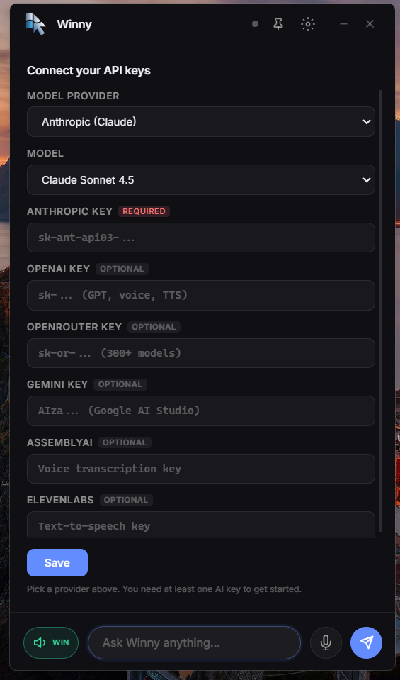
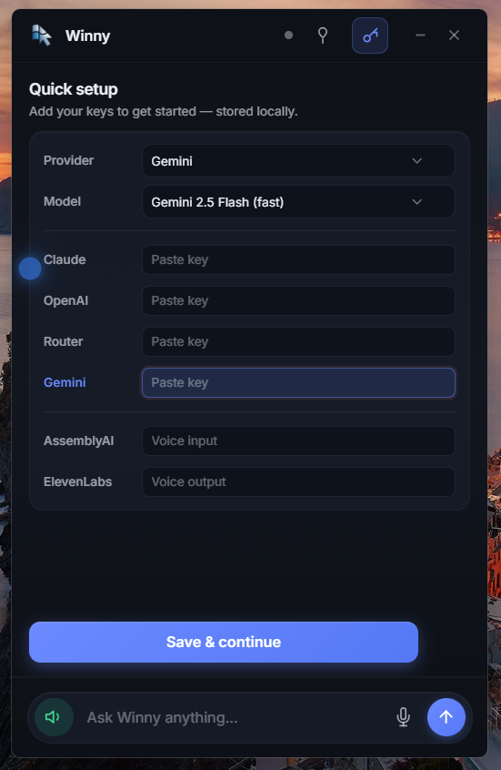

  
  
  # Winny - Your Screen-Aware AI Buddy 🪟

  **The AI that actually sees your screen.**

## ✨ Features

- **Real-time Screen Understanding** — Winny sees and understands everything on your screen
- **Voice & Text Input** — Speak naturally using your microphone or just type
- **Visual Guidance** — Points at buttons, highlights elements, and shows you exactly where to click
- **Smart Actions** — Opens websites, fills forms, controls apps, and gets things done for you
- **Natural Voice Output** — Powered by ElevenLabs
- **Speech Recognition** — Powered by AssemblyAI
- **Multi-Model Support** — Flexible and more models coming soon

## How it Works

Run Winny in the background.  
Tell it what you want (by voice or text) → It sees your current screen → Understands context → Helps you instantly.

No more copy-pasting. No window switching. Just natural interaction.

## Screenshots

## Tech Stack

- **Vision & Reasoning**: Multi-model support
- **Speech-to-Text**: AssemblyAI
- **Text-to-Speech**: ElevenLabs
- **Platform**: Windows

## Installation

(Coming soon — Add download link / installer here)

## Roadmap

- More AI model integrations
- Improved visual pointing & overlays
- App-specific automations
- Conversation memory & personalization
- And much more...

---

## 🐛 Bugs & Issues

Found a bug or have a feature request?

- **[Report a Bug / Request a Feature](https://github.com/jhasanofficial/winny/issues/new/choose)**
- [View All Issues](https://github.com/jhasanofficial/winny/issues)

**When reporting an issue, please include:**
- Winny version number
- Your Windows version
- Screenshots or screen recording (highly recommended)
- Steps to reproduce the problem

  ---

**Made with ❤️ for Windows users who want a truly helpful AI companion.**

If you like the project, don't forget to star ⭐ the repo!
